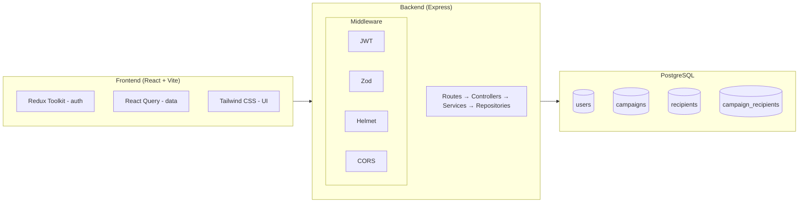

# Mini Campaign Manager

A full-stack Mini Campaign Manager — a simplified MarTech tool that lets marketers create, manage, and track email campaigns.

## Tech Stack

**Backend:** Node.js, Express, PostgreSQL, Knex.js, JWT (httpOnly cookies), bcrypt, Zod, Helmet  
**Frontend:** React 18, TypeScript, Vite, Redux Toolkit, React Query, Tailwind CSS  
**Testing:** Jest, Supertest

## Architecture



## Quick Start

### Prerequisites

- Node.js 18+
- PostgreSQL 14+
- Yarn 1.x

### Setup

```bash
# 1. Clone and install
git clone <repo-url>
cd mini-campaign
yarn install

# 2. Configure environment
cp .env.example .env
# Edit .env with your database connection string

# 3. Create databases
createdb minicampaign
createdb minicampaign_test

# 4. Run migrations
yarn backend:migrate

# 5. Start development servers
yarn backend:dev   # API server on http://localhost:3000
yarn frontend:dev  # Vite dev server on http://localhost:5173
```

### Running Tests

```bash
yarn backend:test
```

## Project Structure

```
mini-campaign/
├── packages/
│   ├── backend/
│   │   ├── src/
│   │   │   ├── controllers/     # HTTP request handling
│   │   │   ├── services/        # Business logic
│   │   │   ├── repositories/    # Database queries (Knex)
│   │   │   ├── middleware/      # Auth, validation, error handling
│   │   │   ├── schemas/         # Zod validation schemas
│   │   │   ├── routes/          # Express route definitions
│   │   │   └── db/              # Knex connection + migrations
│   │   └── tests/               # Jest + Supertest integration tests
│   └── frontend/
│       └── src/
│           ├── components/      # Reusable UI components
│           ├── pages/           # Route-level page components
│           ├── hooks/           # React Query + auth hooks
│           ├── store/           # Redux Toolkit (auth state)
│           └── lib/             # Axios client, utilities
```

## API Endpoints

| Method | Path | Auth | Description |
|--------|------|------|-------------|
| POST | `/api/auth/register` | No | Register a new user |
| POST | `/api/auth/login` | No | Login, returns JWT in httpOnly cookie |
| POST | `/api/auth/logout` | No | Clear auth cookie |
| GET | `/api/campaigns` | Yes | List user's campaigns |
| POST | `/api/campaigns` | Yes | Create campaign with recipients |
| GET | `/api/campaigns/:id` | Yes | Campaign details + recipients |
| PATCH | `/api/campaigns/:id` | Yes | Update draft campaign |
| DELETE | `/api/campaigns/:id` | Yes | Delete draft campaign |
| POST | `/api/campaigns/:id/schedule` | Yes | Schedule campaign |
| POST | `/api/campaigns/:id/send` | Yes | Send campaign (simulate) |
| GET | `/api/campaigns/:id/stats` | Yes | Campaign statistics |

## Business Rules

- Campaigns can only be edited or deleted when status is `draft`
- `scheduled_at` must be a future timestamp
- Sending transitions status to `sent` and cannot be undone
- Stats are computed from real `campaign_recipients` data

## Database Schema

Four tables: `users`, `campaigns`, `recipients`, `campaign_recipients` (junction).

Key indexes:
- `idx_campaigns_created_by` — fast listing of user's campaigns
- `idx_campaigns_status_scheduled` — partial index for background job to find due campaigns
- `idx_cr_recipient_id` — reverse lookup for recipient's campaigns
- `idx_cr_campaign_status` — index-only scan for stats aggregation

## Security

- **JWT in httpOnly cookies** — prevents XSS token theft
- **bcrypt** (cost factor 12) — secure password hashing
- **Zod validation** — input validation + unknown field stripping
- **Helmet** — security headers
- **CORS** — restricted to frontend origin with credentials
- **Ownership checks** — all campaigns scoped to authenticated user

## Scaling Considerations

These are documented as code comments (not implemented):

- **Message queue** for sending: Replace synchronous send with Bull/BullMQ + Redis for batch processing with retry/backoff
- **Redis caching** for stats: Cache computed stats with short TTL, invalidate on send
- **Read replicas**: Route list/stats queries to replicas, writes to primary
- **Table partitioning**: Partition `campaign_recipients` by campaign_id for large-scale deployments

## Tests

5 integration tests covering critical business logic:

1. **Draft-only editing** — editing/deleting a scheduled campaign returns 400
2. **Schedule validation** — past dates rejected, future dates succeed
3. **Send simulation** — status transitions, all recipients marked as sent
4. **Stats accuracy** — correct counts and rates with mixed recipient statuses
5. **Full lifecycle** — create → edit → schedule → send → stats → immutability

## How I Used Claude Code

### Tasks Delegated to Claude Code

- **Database schema design**: I described the four entities and their relationships. Claude generated the full migration with proper constraints (CHECK, FK, CASCADE), UUIDs, and indexes with explanations for each.
- **Backend scaffolding**: I provided the layered architecture requirements (routes → controllers → services → repositories) and Claude generated all files following the pattern consistently.
- **Frontend component creation**: After defining the pages and data flow, Claude generated all React components, hooks (React Query + Redux), and page layouts with Tailwind styling.
- **Test suite**: I described the business rules to test, and Claude wrote 5 comprehensive integration tests using Supertest with proper setup/teardown.

### Real Prompts Used

1. "Build a full-stack Mini Campaign Manager — here is the exact spec..." (provided the complete challenge specification and asked for a detailed plan first)
2. "Create a DETAILED PLAN first: High-level architecture, file/folder structure, database schema with indexes, security measures, scaling considerations, implementation order"
3. "Ask clarifying questions if any before finalizing the plan" — Claude asked about endpoint specifics, send simulation behavior, and Redux vs React Query state split

### Where Claude Was Wrong or Needed Correction

- **ESM + Jest configuration**: Claude initially set up Jest with ESM transforms (`useESM: true`) and global setup files. Knex's migration runner needs `--experimental-vm-modules` to import .ts files, which conflicted with Jest's transform pipeline. I had to guide Claude to simplify: run migrations via a `pretest` script using `tsx` and remove the global setup.
- **Express v5 types**: Claude wrote `req.params.id` directly, but `@types/express` v5 types `params` as `string | string[]`. Needed `as string` assertions in the controller.
- **PostgreSQL connection defaults**: Claude defaulted to `postgres:postgres@localhost` in the Knex config, which doesn't work on macOS where PostgreSQL uses socket auth with the current user. Had to update to `postgres://localhost:5432/...`.

### What I Would Not Let Claude Do and Why

- **Security review**: I manually reviewed the JWT cookie configuration (httpOnly, secure, sameSite), bcrypt cost factor, and CORS settings. Security-critical code should always be human-reviewed.
- **Database index decisions**: While Claude proposed indexes, I verified each one against the actual query patterns in the spec. Unnecessary indexes waste write performance and storage.
- **Business rule validation**: I manually tested each business rule (draft-only editing, future schedule dates, irreversible sends) via curl before accepting the implementation. These are the core requirements and must be verified by a human.
